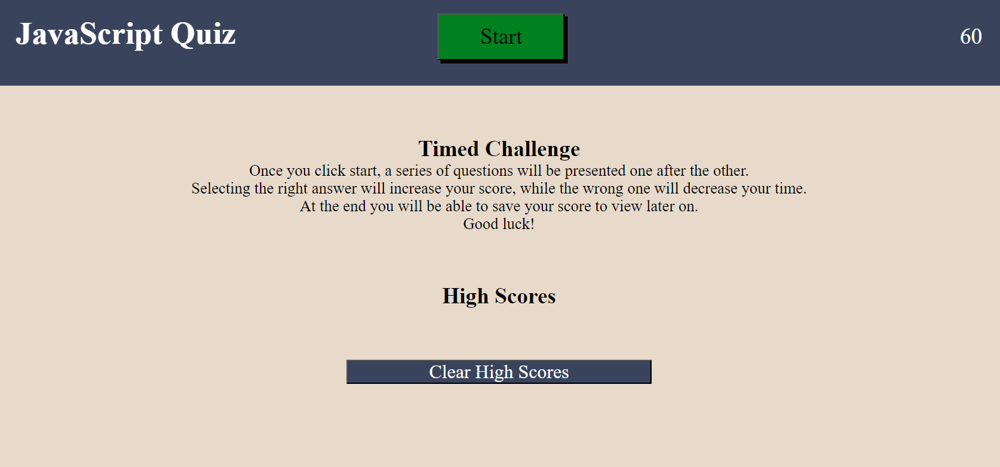

# Timed JavaScript Quiz

This quiz was designed to test basic knowledge of JavaScript.
 It is a timed quiz with a limit of 60 seconds.
 Upon selecting the correct answer, 25 points will be added to the score.
 Selecting the wrong answer will subtract 10 seconds from the timer instead.
 At the end of the quiz you will be told your score and allowed to input your initials.

[A link to the website can be found here.](https://anthonyrqqq.github.io/js-timed-quiz)

### Sources
- Code for lines 36-43 assisted by Xpert Learning Assistant
